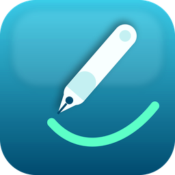

<p align="center">
  
</p>

# miPDFsign Community

[](LICENSE) [](https://github.com/Mibuw/miPDFsign-Community/releases/latest)

**miPDFsign Community** is the free, open-source (**AGPL-3.0**) edition of miPDFsign — a .NET 8 WPF application for signature tablets. It captures handwritten signatures together with biometric pressure data and embeds them as a **PAdES signature** into PDF documents. It uses the **iText** PDF engine (AGPL).

---

## Installation

**Download:** the signed installer from the [latest release](https://github.com/Mibuw/miPDFsign-Community/releases/latest).

**winget:**
```powershell
winget install Mibuw.miPDFsignCommunity
```

**Chocolatey:**
```powershell
choco install mipdfsign-community
```

**Silent / unattended** (Inno Setup — for automation & deployment):
```powershell
miPDFsignCommunity_Setup_1.0.0.exe /VERYSILENT /SUPPRESSMSGBOXES /NORESTART
```

Installs **side-by-side** with the commercial miPDFsign edition (separate AppId & folder).

---

## Features

- **Handwritten signature capture** on all pen-based, Windows-Ink-capable devices (tablets, notebooks, Surface, etc.) including pressure and timing data – no Wintab driver required
- **Biometric data** is hybrid-encrypted (RSA-OAEP 3072 bit + AES-256-CBC) and embedded in the PDF in a proprietary format
- **PAdES signatures** at levels Baseline-**B / T / LT / LTA**
- **Multi-signature** per PDF (freehand mode) via incremental iText updates – existing signatures remain valid
- **QES support** via ID Austria / A-Trust
- **PDF rendering** of pages as bitmaps (PDFium) for display and field placement
- **PDF form detection**: signature, date, location, and checkbox fields are read out automatically
- **Configurable UI texts** via `miPDFsign.ui-labels.json` – editable without recompilation

---

## Technical Details

| Property | Value |
|---|---|
| Framework | .NET 8 (`net8.0-windows`, WinExe) |
| Platform | x86 (`PlatformTarget = x86`) |
| UI | WPF (`UseWPF = true`) |
| Namespace | `miPDFsign` |

### Libraries Used

| Package | Purpose |
|---|---|
| `itext` (+ `itext.bouncy-castle-adapter`) | PDF forms, stamping, PAdES signing (AGPL) |
| `BouncyCastle.Cryptography` | Custom CMS attributes, biometrics encryption |
| `PdfiumViewer` (+ native x86/x64) | Render PDF pages as bitmaps |
| `System.Drawing.Common` | Bitmap processing |
| `System.Configuration.ConfigurationManager` | `App.config` / appSettings |

---

## Project Structure

```
miPDFsignCommunity/
├── App.xaml / App.xaml.cs          # Entry point (iText – no license key needed)
├── MainWindow.xaml / .cs           # Main window
├── IdAustriaWindow.xaml / .cs      # QES signature via ID Austria
├── SignatureTypeDialog.xaml / .cs  # Signature type selection
├── miPDFsign.ui-labels.{en,de}.json   # UI texts, bilingual (editable without recompile)
├── Assets/                         # Icon, logos
├── Helpers/
│   ├── PdfCertSigner.cs            # PDF signing (PAdES B/T/LT/LTA, core component)
│   ├── PdfExporter.cs              # Export / merge PDF
│   ├── PdfLoadHelper.cs            # Load PDF, determine page size
│   ├── PdfRenderer.cs              # PDF pages as bitmap via PDFium
│   ├── PdfSignatureScanner.cs      # Read signature fields from PDF
│   ├── UiLabels.cs                 # UI label management
│   └── AppLogger.cs                # Central logging
├── Models/                         # Field descriptors (signature, date, location, checkbox)
└── Setup/                          # Inno Setup script & build scripts
```

---

## Signature Architecture (Brief Overview)

All signature fields are signed with **iText** in append mode (`PdfSigner` +
`IExternalSignatureContainer`), so each field is added as an incremental revision and
existing signatures stay valid. The CMS is built with BouncyCastle
(`/SubFilter /ETSI.CAdES.detached`, SHA-256, ESS SigningCertificateV2 + an encrypted
biometric attribute). The signature appearance is the pressure-sensitive ink rendered
as a transparent PNG.

**PAdES levels:**

| Level | Description |
|---|---|
| Baseline-B | Always – base CMS signature |
| Baseline-T | RFC-3161 timestamp (TSA, best-effort) |
| LT (LTV) | CRL + OCSP embedded for all certificates (DSS) |
| LTA | Document timestamp over the entire PDF |

### Biometric data & key

The captured ink (X/Y coordinates, pen pressure, timing) is hybrid-encrypted
(RSA-OAEP 3072-bit + AES-256-CBC) and embedded in the signature CMS as a signed
attribute. **Both** signature types (FES and QES) encrypt it with the **same
dedicated, persistent biometric certificate** — never with the short-lived signing
certificate — so the biometric data stays recoverable after the signing certificate
has expired:

- If `BiometricCertPath` (`App.config`) points to a PFX, that certificate is used.
- Otherwise a fresh RSA-3072 certificate is generated once and stored next to the
  document as **`<DocumentName>_bioCert.pfx`**.

> ⚠️ **Keep this PFX safe.** Its private key is required to later decrypt/verify the
> biometric data (forensic use via `ExtractBiometricData`). Losing it makes the
> encrypted biometric data unrecoverable.

---

## Build & Deployment

```bash
# Debug build
dotnet build -c Debug

# Release / Publish (self-contained, win-x86, multi-file)
dotnet publish -c Release
```

The publish is **self-contained** (no .NET runtime required on the target machine)
and consists of `miPDFsignCommunity.exe` + `miPDFsignCommunity.dll` together with all dependencies in one
folder. The installer is generated via the Inno Setup script under `Setup/`
(see `Setup/build.bat`).

---

## Development Environment

- **Visual Studio** (recommended for the XAML designer)
- **VS Code** with the *VS Code Tools for WPF* possible

---

## Works well with — miPDFconvert

Need a PDF to sign in the first place? **[miPDFconvert](https://github.com/Mibuw/miPDFconvert)**
is a free, open-source (AGPL) **virtual PDF printer** for Windows: print from *any*
application to a PDF, then sign it here — a natural upstream **pre-stage**:

> **print → PDF ([miPDFconvert](https://github.com/Mibuw/miPDFconvert)) → sign (miPDFsign Community) → archive**

- [miPDFconvert on GitHub](https://github.com/Mibuw/miPDFconvert) · [latest release](https://github.com/Mibuw/miPDFconvert/releases/latest)

---

## License

**miPDFsign Community is a free, open-source edition**, licensed under the
**GNU Affero General Public License v3.0** (AGPL-3.0) — see [`LICENSE`](./LICENSE).
Because it links **iText** under the AGPL, the entire application is AGPL: if you
distribute it (or offer it over a network), you must make the complete corresponding
source available under the same license.

### Commercial edition

A **commercial edition of miPDFsign is available on request** — without AGPL
obligations and with **additional features** (e.g. an inbound/outbound plugin
architecture, archive/DMS connectors, system integrations, and priority support). It
is a separate product built on a commercially licensed PDF engine. Please
[get in touch](#author) for licensing, pricing, and a feature overview.

Third-party components and their licenses are documented in
[`THIRD-PARTY-NOTICES.md`](./THIRD-PARTY-NOTICES.md).

---

## Author

**Wolfgang Mitterbucher** — Software Engineering & Digital Identity, Leonding (Austria)

🌐 [www.mitterbucher.com](https://www.mitterbucher.com) · 💼 [LinkedIn](https://at.linkedin.com/in/wolfgangmitterbucher) · ✉️ office@mitterbucher.com

**More open-source projects:** [miPDFconvert](https://github.com/Mibuw/miPDFconvert) · [miPDFvalidator](https://github.com/Mibuw/miPDFvalidator) · [miEUDIverifier](https://github.com/Mibuw/miEUDIverifier)
